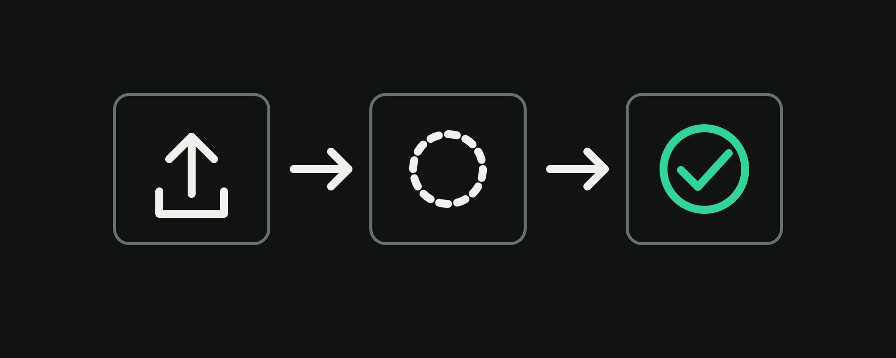

# StateGlyph

[](https://github.com/kamalhara/StateGlyph/actions/workflows/ci.yml)
[](https://www.npmjs.com/package/@stateglyph/react)
[](https://stateglyph.js.org/)
[](./LICENSE)
[](#bundle-size)



StateGlyph is an open-source collection of typed React icons that communicate
what an interface is doing, not only what an action looks like. Each component
has named states such as `idle`, `loading`, and `success`, with accessible
labels and predictable TypeScript props.

The first release contains 31 icons across async actions, media, navigation,
feedback, forms, commerce, and notifications. The icons use the open-source
[Lucide](https://lucide.dev/) icon set as their visual foundation.

> StateGlyph is currently an early `0.1.0` release. The API may evolve before
> version `1.0.0`.

[Documentation](https://stateglyph.js.org/) · [Browse icon definitions](./packages/core/src/icons) · [Contributing](./CONTRIBUTING.md)

## Why StateGlyph?

- **One component, many states.** Keep idle, loading, success, error, and
  toggle glyphs behind one stable, typed component API.
- **Accessible by design.** Icons are decorative by default and can expose
  state-aware labels when they carry meaning.
- **Use it your way.** Import tree-shakeable React components or copy
  self-contained source into your project with the CLI.
- **Open foundations.** Every definition records its source icons and license
  metadata.

## Install the React package

```bash
npm install @stateglyph/react
```

Import from the main package:

```tsx
import { UploadStateIcon } from "@stateglyph/react";

export function UploadButton() {
  return <UploadStateIcon state="uploading" />;
}
```

Or import one icon directly:

```tsx
import { UploadStateIcon } from "@stateglyph/react/upload";
```

StateGlyph components are decorative by default. Give an icon an accessible
name when it communicates information that is not already written nearby:

```tsx
<UploadStateIcon state="success" decorative={false} label="Upload complete" />
```

## Copy components with the CLI

The CLI copies editable components into your own project. This is useful when
you want to own the source instead of installing the React package.

```bash
npx @stateglyph/cli list
npx @stateglyph/cli add upload
npx @stateglyph/cli add upload save --dir src/components/stateglyph
npx @stateglyph/cli add all
```

Generated components require `react` and `lucide-react` in the receiving
project. Existing files are preserved unless you pass `--force`.

## Packages

| Package                   | Purpose                                              |
| ------------------------- | ---------------------------------------------------- |
| `@stateglyph/react`       | Ready-to-use React components                        |
| `@stateglyph/core`        | Framework-independent icon definitions and metadata  |
| `@stateglyph/cli`         | Copy-and-own component generator                     |
| `@stateglyph/transitions` | Optional CSS transitions with reduced-motion support |

To enable the transition declared by each icon definition, install the optional
package and import its stylesheet once. It includes `crossfade`, `scale-fade`,
`rotate`, `slide`, and `morph`, plus continuous loading-state rotation and a
reduced-motion fallback:

```ts
import "@stateglyph/transitions/styles.css";
```

## Bundle size

A direct per-icon entry such as `@stateglyph/react/upload` adds approximately
1.4 kB gzipped of StateGlyph wrapper code before your bundler processes the
selected Lucide glyph. Direct entries and the main package are tree-shakeable.

## Local development

This repository is an npm workspace monorepo using TypeScript, Next.js,
Tailwind CSS, tsup, and Vitest.

```bash
npm install
npm run dev
```

Before opening a pull request, run:

```bash
npm run lint
npm run typecheck
npm test
npm run build
```

See [CONTRIBUTING.md](./CONTRIBUTING.md) for the contribution workflow.

## License

StateGlyph is available under the [MIT License](./LICENSE). The underlying
Lucide icons are available under the ISC License.
